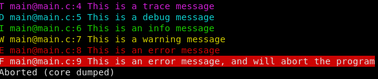

# Log
A super simple header-only logger for C/C++

## Example
```c
#include "log.h"

int main(void) {
    trace("This is a trace message");
    debug("This is a debug message");
    info("This is an info message");
    warn("This is a warning message");
    error("This is an error message");
    fatal("This is an error message, and will abort the program");
}
```

### Output

